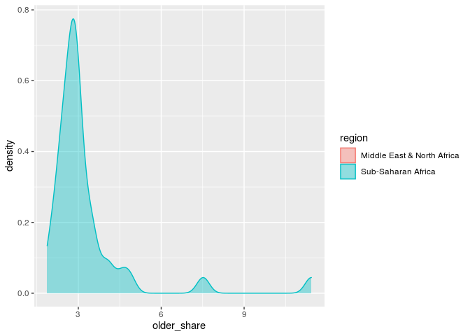

How does the proportion of people aged 65+ affect Covid-19 mortality
across continents?
================
Team 5
December 8, 2020

``` r
library(tidyverse) 
library(dsbox) 
install.packages("magrittr") 
install.packages("dplyr")    
library(magrittr)
library(dplyr) 
install.packages("tufte")
library(ggplot2)
library(gridExtra)
```

The research done and data provided by WZB, Institutions and Political
Inequality Group stands out due to its detailed annotation. However,
even more commendable is its complete transparency with the data
collected and the way it has been manipulated. This empowers readers to,
firstly, gain a deeper understanding of the results and the workings of
statistical models, and, secondly, contribute with their own analysis.

This is exactly what my teammates and I did. The process is a lengthy
one and filled with trial and error. Firstly, one must go through all
the variables and understand what they entail. This resulted in 132
columns.

``` r
covid <- read_csv("data.csv")
```

    ## Warning: Missing column names filled in: 'X1' [1]

    ## 
    ## ── Column specification ────────────────────────────────────────────────────────
    ## cols(
    ##   .default = col_double(),
    ##   geoid2 = col_character(),
    ##   date = col_date(format = ""),
    ##   date_rep = col_date(format = ""),
    ##   country = col_character(),
    ##   continent = col_character(),
    ##   region = col_character(),
    ##   distancing_bin = col_logical(),
    ##   lockdown_bin = col_logical(),
    ##   lockdown_n = col_logical(),
    ##   distancing_n = col_logical(),
    ##   days_rel_lockdown = col_logical(),
    ##   days_rel_distancing = col_logical(),
    ##   retail = col_logical(),
    ##   grocery = col_logical(),
    ##   parks = col_logical(),
    ##   transit = col_logical(),
    ##   work = col_logical(),
    ##   residential = col_logical(),
    ##   stringency = col_logical(),
    ##   C1_School.closing = col_logical()
    ##   # ... with 16 more columns
    ## )
    ## ℹ Use `spec()` for the full column specifications.

``` r
# names(covid)
```

Then the team ran through the data set to see its structure. Going
through the table produced, the team decided how to equally distribute
the workload. It made sense to distribute geographically. We divided the
world into three vertical strips:

  - North America, Central America and South America,

  - Europe and Africa,

  - Asia, Oceania and Australia.

I chose to analyze the first part: North America, Central America and
South America. To do this, the data set had to be filtered for these
three values and saved into a new variable. After skimming through the
data, I realized that countries belonging to all three parts are saved
under the same category for continent = America. The data set was
filtered for countries, where the continent value is set equal to
America and then saved into a new variable.

``` r
# Filter for the Americas 

  covid_america <- covid %>%
  filter(continent == "America")
  nrow(covid_america)
```

    ## [1] 48

``` r
# covid_america
```

The new data set has 48 countries saved into rows and the same 132
variables saved into columns. For initial glimpse of the data at hand, I
plotted a simple point graph, which visualizes the relationship between
cumulative cases and cumulative deaths in the Americas to see if there
seems to be a pattern.

``` r
# Map initial glimpse of the data: cumulative deaths & cumulative cases

covid_america %>%
  ggplot(
    mapping = aes(x= deaths_cum,
                  y = cases_cum)) +
  theme_bw()+
  labs(y="Cumulative cases", x="Cumulative deaths")+
  ggtitle("Cumulative cases vs Cumulative deaths in the Americas")+
  scale_x_log10()+
    geom_point()
```

    ## Warning: Transformation introduced infinite values in continuous x-axis

<!-- -->

Immediately after plotting this, it is obvious there are two extreme
outliers. This skews the plot, not allowing for careful examination of
the majority of values. These two values must be omitted. To do so a new
value is created, where only variables with cumulative cases below
2,500,000 are saved. Another variable is created that saves the two
outliers to see who these two countries are. Unsurprisingly, the country
with the most cumulative Covid-19 cases is the United States with
12,089,438 cumulative cases (at the time, when the data was collected).
The second country is Brazil with 6,052,786 cumulative cases (at the
time, when the data was collected).

``` r
# There are two obvious outliers - will remove them to enable a closer analysis. Remove by filtering cumulative cases < 2,500,000

new_covid_america <- covid_america %>% filter (cases_cum < 2500000) 
outliers <- covid_america %>% filter (cases_cum > 2500000)

# outliers
```

Now it is possible to delve into a more detailed analysis of the
remaining 46 countries spanning the Americas. However, the process was
not as smooth as one might think. When brainstorming, which variables
might be of interest for the team’s analysis, we decided to analyze
lockdown measures as this is something that acutely affects all of us
and frequents media headlines. After settling on the lockdown variables,
I started running through the data for the Americas. I quickly realized
that nearly all values for the lockdown variables were missing and
marked N/A. The data set had been created too early on in the pandemic
to incorporate data reflecting lockdown measures and their
effectiveness.

This idea was quickly scrapped and we had to move on to measuring
different variables. This time we immediately made sure that the
variables we are interested in had sufficient amounts of valid values.
As a team, we decided that we want to focus on variables measuring the
specificities in populations across the world as this might offer
interesting insights about human diversity across the globe. Thus, we
settled on measuring how the proportion of people aged 65+ affects
Covid-19 mortality across the globe.

To do this, I started with the initial step of measuring Covid-19
mortality. In this paper, Covid-19 mortality is measured as the
proportion of cumulative deaths when measured against cumulative cases.
Of course one must keep in mind the limitations, when measuring and
defining these two variables as different governments around the world
report data based on different definitions.

After plotting the two variables against each other, a clearer pattern
emerges. If mortality is measured as the slope of the graph, where the x
value is the number of cumulative cases and the y value is the number of
cumulative deaths, there seems to be a linear relationship until a
certain point (around 1,000,000 and 1,500,000 cumulative cases), where
mortality plateaus. There are definitely too few countries with high
cumulative death numbers to trust this pattern. Therefore, a similar
process has to be repeated, where the outlier has to be filtered out
(after creating a separate variable, we find the outlying country with
cumulative deaths greater than 7,500,000 is Mexico). Now plotting the
new variable that does not entail Mexico, the relationship is obviously
linear. We learn that, in the Americas, cumulative deaths are
proportionally related to cumulative cases. From here further research
discussing the implications and related policies from governments could
be done.

``` r
# Plot again cumulative cases and cumulative deaths with the new data set


new_covid_america <- transform (new_covid_america,
                                                CumulativeCases = (cases_cum)/((population_2019)/1000000)
                                                                   )


new_covid_america %>%
  ggplot(
    mapping = aes(x= deaths_cum,
                  y = CumulativeCases)) +
  theme_bw()+
  
  labs(y="Cumulative cases per Million", x="Cumulative deaths")+
  ggtitle("Cumulative cases vs Cumulative deaths in the Americas, excluding outliers")+
  
  geom_point()+
  stat_smooth(method="lm")
```

    ## `geom_smooth()` using formula 'y ~ x'

<!-- -->

``` r
outlier_deaths <- new_covid_america %>% filter (deaths_cum > 75000)
# outlier_deaths


new_covid_america_without_outlier <- new_covid_america %>% filter (deaths_cum < 75000)

new_covid_america_without_outlier <- transform (new_covid_america_without_outlier,
                                                CumulativeCases = (cases_cum)/((population_2019)/1000000)
                                                                   )  

new_covid_america_without_outlier %>%
  ggplot(
    mapping = aes(x= deaths_cum,
                  y = CumulativeCases)) +
  theme_bw()+
  
  labs(y="Cumulative cases per Million", x="Cumulative deaths")+
  ggtitle("Cumulative cases vs Cumulative deaths in the Americas, excluding outliers")+
  
  geom_point()+
  stat_smooth(method="lm")
```

    ## `geom_smooth()` using formula 'y ~ x'

<!-- -->

Now after defining and analyzing mortality and its relationship to
cumulative cases and cumulative deaths, we can move on to the variables
analyzed in this paper. For this, three variables are added to the
dataset. Firstly, we must create a new variable that combines both the
female population that is 65+ and the male population that is 65+. Then,
we must look at the share of the population that is 65+ against the
total population of a country. This is saved into a new variable too.
Here we also define mortality as cumulative deaths divided by cumulative
cases.

``` r
# Create a new variable for population over 65
# Create a new variable for mortality rate
# Now check for the variables that we are researching cumulative cases, cumulative deaths, population density, migration share

new_covid_america_without_outlier <- transform(new_covid_america_without_outlier, 
                               pop_older = older_m + older_f
                               )

new_covid_america_without_outlier <- transform(new_covid_america_without_outlier,
                              older_share = (pop_older / population_2019)*100
                              )

new_covid_america_without_outlier <- transform(new_covid_america_without_outlier, 
                              mortality = (deaths_cum / cases_cum)
                              )
new_covid_america_without_outlier <- transform(new_covid_america_without_outlier, 
                              Mortality = (mortality)/((population_2019)/1000000)
                              )


new_covid_america <- transform(new_covid_america, 
                               pop_older = older_m + older_f
                               )

new_covid_america <- transform(new_covid_america,
                              older_share = (pop_older / population_2019)*100
                              )

new_covid_america <- transform(new_covid_america, 
                              mortality = (deaths_cum / cases_cum)
                              )

new_covid_america <- transform(new_covid_america, 
                              Mortality = (mortality)/((population_2019)/1000000)
                              )
```

Now we can finally plot Covid-19 mortality against the share of
population that is 65 or older. While the uncertainty is quite high,
there seems to be a negative relationship between the two variables.
This is quite surprising as our initial hypothesis stated that countries
that have a larger proportion of citizens aged 65 or higher would see
higher Covid-19 mortality rates. The data suggests that as the share of
population aged 65 or older increases, Covid-19 mortality falls. This
might be due to the small dataset or due to powerful confounding
variables.

``` r
  new_covid_america_without_outlier %>%
  ggplot(
    mapping = aes(x=older_share,
                  y = Mortality)) +
  theme_bw()+
  
  labs(y="Mortality", x="Share of population aged 65+")+
  ggtitle("Proportion of population aged 65+ vs Mortality")+
  
  geom_point()+
  stat_smooth(method="lm")
```

    ## `geom_smooth()` using formula 'y ~ x'

    ## Warning: Removed 11 rows containing non-finite values (stat_smooth).

    ## Warning: Removed 11 rows containing missing values (geom_point).

<!-- -->

To further explore the dataset, I went back to the beginning to see
further variables available for each country. The next step was to
filter the new dataset based on the region. This is where I ran into a
disadvantage of the dataset. It classifies the countries based on only
two regions:

  - North America (the US and Canada)

  - Latin America & Caribbean

  - Europe and Central Asia (Greenland)

  - N/A

There are two details that seemed quite shocking. Greenland is
classified as “Europe & Central Asia” as a region, but “America” as a
continent. After careful consideration, I decided to leave the data
point in my dataset since it would have little effect due to its small
population. Second, I was surprised that the entire continent of South
America fell under Latin America & Caribbean. After omitting the United
States as an outlier because of its extreme number of cumulative cases,
I ended up with only two countries in the North America category (Canada
and Bermuda (again, quite surprising)), one country in the Europe &
Central Asia category and the rest of the countries fell under the Latin
America & Caribbean category. Thus, further analysis based on region is
inconclusive.

``` r
# Filter the different regions: Latin America & Caribbean, North America
  new_covid_america_without_outlier %>%
  ggplot(
    mapping = aes(x=older_share,
                  y = Mortality,
                  color = region,
                  fill = region)) +
 theme_bw()+
  
  labs(y="Mortality", x="Share of population aged 65+")+
  ggtitle("Proportion of population aged 65+ vs Mortality; categorized by region")+
  
  geom_point()+
  stat_smooth(method="lm")
```

    ## `geom_smooth()` using formula 'y ~ x'

    ## Warning: Removed 11 rows containing non-finite values (stat_smooth).

    ## Warning: Removed 11 rows containing missing values (geom_point).

<!-- -->

``` r
europe <- new_covid_america_without_outlier %>% filter (region == "Europe & Central Asia")
# europe


north_america <- new_covid_america %>% filter (region == "North America")
# north_america
```

It makes sense to further inspect mortality rates, when dividing the
dataset in three tiers:

  - Tier 1: older\_share \< 10

  - Tier 2: 10 \<= older\_share \>= 15

  - Tier 3: older\_share \> 15

We see that most countries in the Americas fit within the first tier,
which again proves that most of the countries in the Americas have young
populations. Tier 2 and tier 3 has too few data points to draw a
conclusion and tier 1 seems to counterintuitively state that countries
with older populations have lower mortality rates. This could have
multiple explanations, but most likely is affected by confounding
variables such as income levels.

``` r
first_new_covid_america_without_outlier <- new_covid_america_without_outlier %>% filter (older_share < 10)
second_new_covid_america_without_outlier <- new_covid_america_without_outlier %>% filter (older_share >= 10 & older_share <= 15)
third_new_covid_america_without_outlier <- new_covid_america_without_outlier %>% filter (older_share > 15)

sp1 <- first_new_covid_america_without_outlier %>%
  ggplot(
    mapping = aes(x=older_share,
                  y = Mortality,
                  color = region,
                  fill = region)) +
 theme_bw()+
  
  labs(y="Mortality", x="Share of population aged 65+")+
  ggtitle("Tier 1")+
  
  geom_point()+
  stat_smooth(method="lm")


sp2 <- second_new_covid_america_without_outlier %>%
  ggplot(
    mapping = aes(x=older_share,
                  y = Mortality,
                  color = region,
                  fill = region)) +
 theme_bw()+
  
  labs(y="Mortality", x="Share of population aged 65+")+
  ggtitle("Tier 2")+
  
  geom_point()+
  stat_smooth(method="lm")

sp3 <- third_new_covid_america_without_outlier %>%
  ggplot(
    mapping = aes(x=older_share,
                  y = Mortality,
                  color = region,
                  fill = region)) +
 theme_bw()+
  
  labs(y="Mortality", x="Share of population aged 65+")+
  ggtitle("Tier 3")+
  
  geom_point()+
  stat_smooth(method="lm")


grid.arrange(sp1, sp2, sp3, ncol=1)
```

    ## `geom_smooth()` using formula 'y ~ x'
    ## `geom_smooth()` using formula 'y ~ x'
    ## `geom_smooth()` using formula 'y ~ x'

<!-- -->

A problem with the point plots is that many countries have similar
values, thus the points lie on top of each other, masking the magnitude
of the information in the data available. This is where density plots
make a great choice. Therefore, the same relationships are now revisited
through density plots in hope to discover deeper insights. Now the
overall distribution of values across the continents can be seen. Since
North America has only two values, it is not visible on the graph,
however, this shortcoming has already been discussed. Therefore, the
bulk of the analysis is about Central and South America. The graph
clearly depicts that Latin American & Caribbean countries are relatively
‘young’ countries with only a small share of population aged 65+. The
vast majority of countries are in the 5-10% range. In fact, only Puerto
Rico has more than 20% of its population aged 65+. This prompts the
question whether in the context of Latin America & Caribbean, there are
other variables that play a stronger role in the mortality of Covid-19
than the age of the population.

When inspecting the mortality density graph, it is surprising to see
that countries classified as North America, which are often considered
to be wealthier, with better health care systems, have much higher
mortality rates. Again, one must be careful to look for simple
explanations as the dataset consists of only two countries. In the case
of North America, a study inspecting Covid-19 mortality rates state by
state would prove to be more conclusive.

Inspecting Latin America & Caribbean shows that the vast majority of
countries have mortality rates below 3.5%. However, Bolivia and Ecuador
are extreme outliers that have mortality rates higher than 6%.

However, superimposing the mortality plot on top of the plot
representing the share of population aged 65+ proves inconclusive. There
seems to be little to no relationship between the share of the
population aged 65+ and its respective Covid-19 mortality rates. This
was also observed in the previous point plot, where the share of the
population aged 65+ was plotted against mortality rates and the plot
resulted in an almost horizontal plot with the slope of around 0.

``` r
# geom point is not the best representation since a many points cover each other
 new_covid_america_without_outlier %>%
 ggplot(
    mapping = aes(x=older_share,
                  color = region,
                  fill = region)) +

 theme_bw()+
  
  labs(y="Frequency", x="Share of population aged 65+")+
  ggtitle("Density plot of countries by the share of their populations aged 65+")+
  
  geom_density(alpha=0.4)
```

    ## Warning: Removed 11 rows containing non-finite values (stat_density).

    ## Warning: Groups with fewer than two data points have been dropped.

    ## Warning in max(ids, na.rm = TRUE): no non-missing arguments to max; returning -
    ## Inf

<!-- -->

``` r
  new_covid_america_without_outlier %>%
  ggplot(
    mapping = aes(x=Mortality,
                  color = region,
                  fill = region)) +
 theme_bw()+
  
  labs(y="Frequency", x="Mortality")+
  ggtitle("Density plot of countries by their mortality rates of Covid-19")+
  
  geom_density(alpha=0.4)
```

    ## Warning: Groups with fewer than two data points have been dropped.
    
    ## Warning: no non-missing arguments to max; returning -Inf

<!-- -->

``` r
older <- new_covid_america_without_outlier %>% filter (older_share > 20)
# older

#north_america 

deadly <-new_covid_america_without_outlier %>% filter (mortality > 6)
# deadly

  new_covid_america_without_outlier %>%
  ggplot(
    mapping = aes(x=migration_share,
                  color = region,
                  fill = region)) +
  theme_bw()+
  
  labs(y="Frequency", x="Migrant share of the population")+
  ggtitle("Density plot of countries by the share of migrants")+
  
  geom_density(alpha=0.4)
```

    ## Warning: Removed 3 rows containing non-finite values (stat_density).

    ## Warning: Groups with fewer than two data points have been dropped.

    ## Warning in max(ids, na.rm = TRUE): no non-missing arguments to max; returning -
    ## Inf

<!-- -->

Although this is not the main focus of the research paper, we wanted to
explore a possible confounding variable, since we could not find a
strong relationship between our chosen variables. Reports of Covid-19
case explosions in migrant communities beg the question whether there is
a correlation between mortality rates and the migrant population as a
share of the total population. When it comes to the Americas, the most
affected are Venezuelan migrants. “As of 30 October 2020, more than
136,000 Venezuelan migrants and refugees had returned to Venezuela from
other countries in the region (IOM and UN OCHA, 2020). At its peak, 600
Venezuelans returned from Colombia daily and an average of 88
Venezuelans returned from Brazil daily via the border at Pacaraima
(Coordination Platform for Refugees and Migrants from Venezuela, 2020).”
(Migration Data Portal)

The hypothesis would suggest that countries with a higher share of their
population consisting of migrants would have respectively higher
Covid-19 mortality rates. Superimposing the two density plots onto each
other, we see a strong correlation in North America and a weaker (but
not non-existing) correlation in Latin America & Caribbean. Creating
graphs of both Mortality per million vs Population density and Mortality
per million vs Migrant share of the population shows to be some of the
strongest correlation revealed in this research paper, when it comes to
the Ameriacs. This could be explored in further research papers.

``` r
southamerica <- new_covid_america %>% filter (region == "Latin America & Caribbean")
northamerica <- new_covid_america %>% filter (region == "North America")

sp4 <- southamerica %>%
  ggplot(
    mapping = aes(x = pop_density,
                  y = Mortality,
                  color = region,
                  fill = region)) +
 theme_bw()+
  
  labs(y="Mortality", x="Population density")+
  ggtitle("Latin America & Caribbean")+
  
  geom_point()+
  stat_smooth(method="lm")

sp5 <- northamerica %>%
  ggplot(
    mapping = aes(x = pop_density,
                  y = Mortality,
                  color = region,
                  fill = region)) +
 theme_bw()+
  
  labs(y="Mortality", x="Population density")+
  ggtitle("North America")+
  
  geom_point()+
  stat_smooth(method="lm")


  grid.arrange(sp4, sp5, ncol=1)
```

    ## `geom_smooth()` using formula 'y ~ x'

    ## Warning: Removed 2 rows containing non-finite values (stat_smooth).

    ## Warning: Removed 2 rows containing missing values (geom_point).

    ## `geom_smooth()` using formula 'y ~ x'

    ## Warning in qt((1 - level)/2, df): NaNs produced

    ## Warning in max(ids, na.rm = TRUE): no non-missing arguments to max; returning -
    ## Inf

<!-- -->

``` r
  sp6 <- northamerica %>%
  ggplot(
    mapping = aes(x = migration_share,
                  y = Mortality,
                  color = region,
                  fill = region)) +
 theme_bw()+
  
  labs(y="Mortality", x="Migration share")+
  ggtitle("North America")+
  
  geom_point()+
  stat_smooth(method="lm")
  
    sp7 <- southamerica %>%
  ggplot(
    mapping = aes(x = migration_share,
                  y = Mortality,
                  color = region,
                  fill = region)) +
 theme_bw()+
  
  labs(y="Mortality", x="Migration share")+
  ggtitle("South America")+
  
  geom_point()+
  stat_smooth(method="lm")

    
  grid.arrange(sp6, sp7, ncol=1)
```

    ## `geom_smooth()` using formula 'y ~ x'

    ## Warning in qt((1 - level)/2, df): NaNs produced
    
    ## Warning in qt((1 - level)/2, df): no non-missing arguments to max; returning -
    ## Inf

    ## `geom_smooth()` using formula 'y ~ x'

<!-- -->

``` r
#install.packages(c("coda","mvtnorm","devtools","loo","dagitty","remotes"))
#remotes::install_github("rmcelreath/rethinking")
```

To further discuss the shortcomings of the dataset and analysis itself,
it is useful to look at the statistical values of the dataset at hand.
These tools show us once again that most countries in the Americas have
a relatively low number of cumulative cases. However, the large
difference between the mean and median values mirrors that the dataset
has a few extreme outliers.

``` r
mean(new_covid_america$CumulativeCases, na.rm = TRUE)
```

    ## [1] 10687.47

``` r
median(new_covid_america$CumulativeCases, na.rm = TRUE)
```

    ## [1] 6620.834

``` r
sd(new_covid_america$CumulativeCases, na.rm = TRUE)
```

    ## [1] 11167.48

``` r
CumulativeCases <- new_covid_america$CumulativeCases
  hist(CumulativeCases)
```

<!-- -->

``` r
  plot(CumulativeCases, type = 'b', main = "Cumulative cases of Covid-19 in the Americas")
```

<!-- -->

``` r
summary(new_covid_america$CumulativeCases)
```

    ##    Min. 1st Qu.  Median    Mean 3rd Qu.    Max. 
    ##   201.7  1346.6  6620.8 10687.5 13965.6 44436.1

However, when looking at mortality, the outliers are not as obvious as
with cumulative cases. Some interesting further research exploring this
relationship could also be done. The difference between the median and
the mean is a lot smaller. The histogram shows that there is a more
balanced distribution between 2% mortality and 4% mortality.

``` r
mean(new_covid_america$Mortality)
```

    ## [1] 0.08050732

``` r
median(new_covid_america$Mortality)
```

    ## [1] 0.004196266

``` r
sd(new_covid_america$mMrtality)
```

    ## [1] NA

``` r
Mortality <- new_covid_america$Mortality
  hist(Mortality)
```

<!-- -->

``` r
  plot(Mortality, type = 'b', main = "Covid-19 mortality in the Americas")
```

<!-- -->

``` r
summary(new_covid_america$Mortality)
```

    ##      Min.   1st Qu.    Median      Mean   3rd Qu.      Max. 
    ## 0.0000000 0.0009904 0.0041963 0.0805073 0.0555201 0.7307602

When looking at the share of migrants, we again see a large difference
between the mean and the median values, suggesting there are a few
extreme outliers. The histogram shows us that most countries in the
Americas have migrants as a share of the population of 10% or less.

``` r
mean(new_covid_america$migration_share, na.rm = TRUE)
```

    ## [1] 12.89577

``` r
median(new_covid_america$migration_share, na.rm = TRUE)
```

    ## [1] 4.805

``` r
sd(new_covid_america$migration_share, na.rm = TRUE)
```

    ## [1] 17.08245

``` r
MigrationShare <- new_covid_america$migration_share
  hist(MigrationShare)
```

<!-- -->

``` r
  plot(MigrationShare, type = 'b', main = "Migrant share of the population in the Americas")
```

<!-- -->

``` r
summary(new_covid_america$migration_share)
```

    ##    Min. 1st Qu.  Median    Mean 3rd Qu.    Max.    NA's 
    ##   0.117   1.669   4.805  12.896  15.137  70.448       3

-----

**EUROPE** and **AFRICA**

``` r
covid_3 <- read_csv("data3.csv")
```

    ## 
    ## ── Column specification ────────────────────────────────────────────────────────
    ## cols(
    ##   country = col_character(),
    ##   pop_density = col_double(),
    ##   cases_cum = col_double(),
    ##   deaths_cum = col_double(),
    ##   old_perc = col_double(),
    ##   continent = col_character(),
    ##   region = col_character()
    ## )

``` r
# Filter for Europe

covid_europe_and_africa <- covid %>%
filter(continent == "Europe" | continent == "Africa")
nrow(covid_europe_and_africa)
```

    ## [1] 109

``` r
covid_europe <- covid %>%
filter(continent == "Europe")

covid_africa <- covid %>%
filter (continent == "Africa")
```

**General background**

On 20 Nov. 2020, Europe surpassed 15 million cases, and cases have
abrubtly been rising since then. On 19 ov. 2020, Africa surpassed 2
million cases, and cases have steadily been rising since then. Out of
all the continents in the world, Europe has the biggest amount of cases
to date. It all started in Italy and spread throughout Europe. The
continent has over 400 000 deaths. On the other hand, Africa has the
second to last place in COVID-19 cases, just after Oceania. The
continent has over 50 000 deaths.

Countries vary widely in terms of capacities to prevent, detect and
respond to disease outbreaks. In this paper, we aim to explore these
factors associated with COVID-19 mortalities at the country level,
specifically in the region of Europe and Africa.

We are aware that wealthier countries tend to have more older people
because a good economy allocates more resources in the healthcare of the
country, which in turn provides good resources for the older population
whenever they need them. This is especially important for Europe, as the
continent tends to maintain the number of older people in the European
countries. With that in mind, we decided to explore how the older
population contributes to the acceleration or impedement of the
mortality rate.

Since the variable age does not exist in the data set, we will utilize
other variables to test our hypothesis.

**VARIABLES** we will use from the dataset:

  - **cases\_cum** - Variable for cumulative cases. For instance, the
    number of people who have ever tested positive for coronavirus in a
    given country, regardless of whether they have recovered.

  - **deaths\_cum** - Variable for cumulative deaths. It is the total
    number of people who have died due to coronavirus in a given
    country.

  - **mortality** - Variable that holds the total number of deaths out
    of total COVID-19 positive infected cases.

  - **migration\_share** - Variable that refers to the percentage of
    people who are migrants in the European countries.

  - **old\_perc** - Variable that refers to the percentage of old aged
    population among the total population of the country.

  - **pop\_older** - It is the total old aged population in a country,
    including male and female.

To begin with the analysis, we’ll first plot a basic scatter plot
**(cumulative cases vs cumulative deaths)** showing the initial glimpse
making use of the two variables i.e. cases\_cum and deaths\_cum.

``` r
# Map initial glimpse of the data: cumulative deaths & cumulative cases

covid_europe_and_africa %>%
ggplot(
mapping = aes(x= deaths_cum,
y = cases_cum)) +
  theme_bw() +
labs(y="Cumulative Cases", x = "Cumulative Deaths") +
ggtitle("Cumulative Cases vs Cumulative Deaths in Europe and Africa") +
  scale_x_log10()+
geom_point()
```

    ## Warning: Transformation introduced infinite values in continuous x-axis

<!-- -->

Since there are four outliers, so removing them will enable a more
closer and accurate analysis.This skews the plot, not allowing for
careful examination of the majority of values. These four values must be
omitted. The logarithmic scale supported the creation of this graph as
it allowed for a good and legible upward slope of the cases vs deaths
line.

``` r
# There are two obvious outliers - will remove them to enable a closer analysis. Remove by filtering cumulative cases < 100,000

new_covid_europe_and_africa <- covid_europe %>% filter (cases_cum < 100000)
```

In order to see the effect of density, as well as to satisfy our
curiosity about the effect of the disease on migrants in both Europe and
Africa, we am creating new variables without outliers that would prove
efficient in further analysis.

``` r
new_covid_europe <- covid_europe %>% filter (cases_cum < 100000)
```

``` r
new_covid_africa <- covid_africa %>% filter (cases_cum < 20000)
```

Now, we can plot the **cumulative cases vs cumulative deaths** again
with the new dataset (where the four outliers are removed).

``` r
# Plot again cumulative cases and cumulative deaths with the new data set

new_covid_europe_and_africa %>%
ggplot(
mapping = aes(x= deaths_cum,
y = cases_cum)) +
  theme_bw() +
labs(y="Cumulative Cases", x = "Cumulative Deaths") +
ggtitle("Cumulative Cases vs Cumulative Deaths in Europe and Africa (better representation)") +
geom_point() + stat_smooth(method="lm")
```

    ## `geom_smooth()` using formula 'y ~ x'

<!-- -->

This scatter plot has a **curve going in an upward direction**. Hence,
it has a positive correlation between the two variables i.e. cases\_cum
and deaths\_cum. This means that as the number of positive COVID-19
cases rise, the death cases also rise, but in a fast manner. With big
increase in cases, there is smaller increase in the total death count.

Now, to get a a better view of how the cumulative cases of the virus are
connected with the mortality of COVID-19 cases, we have to create a
graph with those variables.

``` r
covid_3 %>% filter(cases_cum < 100000) %>%
ggplot(mapping = aes(x = cases_cum,

y = (deaths_cum/cases_cum)*100)) +

geom_point() +
geom_smooth(method = lm, se=F) +
theme_bw() +
labs(y="COVID-19 Mortality %", x = "Cumulative Cases")
```

    ## `geom_smooth()` using formula 'y ~ x'

<!-- -->

The plot indicates that there is nearly no correlation, but a slightest
negative correlation between COVID-19 mortality and cumulative cases
overall (including all countries in Europe and Africa).

The residents living in areas with high population density, such as big
or metropolitan cities have a higher probability to come into close
contact with others and consequently any contagious disease is expected
to spread rapidly in dense areas. Now, we’ll analyze and conclude what
kind of relationship exists between these.

To analyze how the variables we have chosen react with each other,
firstly, we have to create and transform a variable called pop\_older so
it includes men and women older than 65. Then, we divide pop\_older with
the population in 2019 to get a variable called older\_share. Lastly, we
create a variable called mortality to show how the cumulative cases and
deaths are connected to one another.

Now, we’ll divide the proportions of old aged population into - **low %
old population** - **moderate % old population** - **high % old
population** in order to see what kind of relationships exist between
the two variables.

**Filtering countries that have old aged population % below 4.718 (LOW
%).**

**Europe** does not have low percentage of old aged population.

  - **North Africa**

  - Libya

  - Sudan

  - **East Africa**

  - Burundi

  - Comoros

  - Djibouti

  - Ethiopia

  - Kenya

  - Madagascar

  - Mozambique

  - Rwanda

  - Malawi

  - Somalia

  - South Sudan

  - Tanzania

  - Uganda

  - Zambia

  - Zimbabwe

  - **Central Africa**

  - Angola

  - Cameroon

  - Equatorial Guinea

  - Congo - Kinshasa

  - Congo - Brazzaville

  - Central African Republic

  - Chad

  - Gabon

  - São Tomé & Príncipe

  - **West Africa**

  - Benin

  - Burkina Faso

  - Côte d’Ivoire

  - Mauritania

  - Ghana

  - Guinea

  - Gambia

  - Guinea-Bissau

  - Mali

  - Liberia

  - Niger

  - Nigeria

  - Togo

  - Sierra Leone

  - Senegal

  - **Southern Africa**

  - Botswana

  - Namibia

  - Eswatini

<!-- end list -->

``` r
sp11 <- covid_3 %>%
filter(old_perc < 4.718) %>%
ggplot(mapping = aes(x = cases_cum,

y = (deaths_cum/cases_cum)*100)) +

geom_point() +
geom_smooth(method = lm, se=F) +
theme_bw(base_size = 10) +
labs(y="COVID-19 Mortality %", x = "Cumulative Cases") +
ggtitle("Countries with low % old population")
```

**Filtering countries that have old aged population % between 4.718 and
7.652 (MODERATE %).**

  - **Eastern Europe/Western Asia**

  - Azerbaijan

  - **North Africa**

  - Algeria

  - Egypt

  - Morocco

  - Tunisia

  - **East Africa**

  - Seychelles

  - **Southern Africa**

  - Lesotho

  - South Africa

<!-- end list -->

``` r
sp21 <- covid_3 %>%
filter(old_perc >= 4.718 & old_perc <= 7.652) %>%
ggplot(mapping = aes(x = cases_cum,

y = (deaths_cum/cases_cum)*100)) +

geom_point() +
geom_smooth(method = lm, se=F) +
theme_bw(base_size = 10) +
labs(y="COVID-19 Mortality %", x = "Cumulative Cases") +
ggtitle("Countries with moderate % old population")
```

**Filtering countries that have old aged population % greater than 8
(HIGH %).**

  - **Northern Europe**

  - Denmark

  - Estonia

  - Finland

  - Ireland

  - Iceland

  - Latvia

  - Lithuania

  - Norway

  - Sweden

  - United Kingdom

  - **South Europe**

  - Albania

  - Bulgaria

  - Bosnia & Herzegovina

  - Cyprus

  - North Macedonia

  - Montenegro

  - Greece

  - Italy

  - Malta

  - Slovenia

  - Serbia

  - Portugal

  - **East Europe**

  - Poland

  - Russia

  - Croatia

  - Slovakia

  - Moldova

  - Romania

  - Hungary

  - Belarus

  - **West Europe**

  - Belgium

  - Switzerland

  - Germany

  - France

  - Luxembourg

  - Netherlands

  - **Central Europe**

  - Czechia

  - Austria

  - **Between Europe and Asia**

  - Armenia

  - Turkey

  - Ukraine

  - Georgia

<!-- end list -->

``` r
sp31 <- covid_3 %>%
filter(old_perc > 8) %>%
ggplot(mapping = aes(x = cases_cum,

y = (deaths_cum/cases_cum)*100)) +

geom_point() +
geom_smooth(method = lm, se=F) +
theme_bw(base_size = 10) +
labs(y="COVID-19 Mortality %", x = "Cumulative Cases") +
ggtitle("Countries with high % old population")

grid.arrange(sp11, sp21, sp31, ncol = 2)
```

    ## `geom_smooth()` using formula 'y ~ x'
    ## `geom_smooth()` using formula 'y ~ x'
    ## `geom_smooth()` using formula 'y ~ x'

<!-- -->

According to the plots, the negative correlation was significant for
countries with moderate and low percentage of old population,
respectively. The overall negative correlation in all three plots might
be due to the fact that countries, with time adopted several preventive
measures, including better healthcare facilities, professionals to
lessen the impact of the virus on its people.

The survival rates seems to have improved, but rising case numbers are
causing the total number of deaths increase. The average age of people
who developed COVID-19 and those visiting emergency rooms due to the
disease dropped as more young people came down with the illness. Thus,
there was an increase in younger people hospitalized with COVID-19.

Moreover, Many people at risk are also taking more steps to reduce the
chances of being exposed to the virus. People who are older and have
more underlying medical conditions are more consistently doing social
distancing, frequent handwashing, and other measures to protect
themselves.

As we compare the above three plots, we see that the countries that had
comparatively lower population of old aged, showed a steeper negative
slope (or comparatively more negative correlation than other two). It
indicates that due to old population already being low, there was more
decrease in mortality rate with rising cases.

While the countries that have moderate percentage of old population,
showed not much decrease in mortality rate or less steeper negative
slope than the previous. This might be because there is more old
population proportion in these countries comparatively.

Based on surveying the countries in Europe and Africa, the countries
that have high percentage of old people, are advanced in terms of
technology, government and have better healthcare system. Although the
countries are advanced, there is a high correlation in % of old
population and COVID-19 mortality scatter plot.

Now, in order to answer the question that this research paper poses -
how does the population of older people (65 and above) as well as the
share of migrants in Europe and Africa separately affect the mortality
rate, we have to create new variables. We are also giving attention to
the confounding variable ‘density’ and see how it is affected by the
number of older people and migrants. For this, three variables are added
to the dataset. Firstly, we must create a new variable that combines
both the female population that is 65+ and the male population that is
65+. Then, we must look at the share of the population that is 65+
against the total population of a country. This is saved into a new
variable too. Here we also define mortality as cumulative deaths divided
by cumulative cases.

We are creating variables for Europe and Africa, together and
separately.

  - For the pop\_older variable, we are combining male and female
    citizens.
  - For the older\_share variable, we are dividing pop\_older with the
    overall population in 2019 and then multiplying the result by a
    hundred.
  - For mortality variable, we are we are dividing deaths\_cum with
    cases\_cum and then multiplying the result by a hundred.

<!-- end list -->

``` r
# Create a new variable for population over 65
# Create a new variable for mortality rate
# Now check for the variables that we are researching cumulative cases, cumulative deaths, population density, migration share

new_covid_europe_and_africa <- transform(new_covid_europe_and_africa,
pop_older = older_m + older_f
)
new_covid_europe_and_africa <- transform(new_covid_europe_and_africa,
older_share = (pop_older / population_2019)*100
)
new_covid_europe_and_africa <- transform(new_covid_europe_and_africa,
mortality = (deaths_cum / cases_cum)*100
)

new_covid_europe <- transform(new_covid_europe,
pop_older = older_m + older_f
)
new_covid_europe <- transform(new_covid_europe,
older_share = (pop_older / population_2019)*100
)
new_covid_europe <- transform(new_covid_europe,
mortality = (deaths_cum / cases_cum)*100
)

new_covid_africa <- transform(new_covid_africa,
pop_older = older_m + older_f
)
new_covid_africa <- transform(new_covid_africa,
older_share = (pop_older / population_2019)*100
)
new_covid_africa <- transform(new_covid_africa,
mortality = (deaths_cum / cases_cum)*100
)

covid_europe_and_africa <- transform(covid_europe_and_africa,
mortality = (deaths_cum / cases_cum)*100
)
```

Now that we have created the variable called “mortality” for the whole
dataset including the outliers of Europe and Africa we can create a
graph that represents the cumulative cases by million to make it
comparable to the mortality rate.

``` r
covid_europe_and_africa %>%
ggplot(
mapping = aes(x= cases_cum / (population_2019/1000000),
y = mortality)) +
  theme_bw() +
labs(y="Mortality (Per Million People)", x = "Cumulative Cases (Per Million People)") +
ggtitle("Cumulative Cases vs Mortality per Million People in Europe and Africa") +
geom_point() + stat_smooth (method = "lm")
```

    ## `geom_smooth()` using formula 'y ~ x'

<!-- -->

The graph shows a peculiar result. It is noticeable that there is one
outlier with around 80,000 cases per million people and that country has
a mortality rate lower than 2%. Although other countries have a way
smaller number of cases per million people than this particular outlier,
they themselves are outliers as they have between 6% and 8% mortality
rate per million people. The situation regardining mortality rate in
both Europe and Africa is not alarming as it is a slope with a downward
inclination.

We’re now making a graph between the population of older people and the
mortality rate. This is important because we are putting the newly
created variables in context, but also these variables give us a clear
perspective of how the population of older people affects the mortality
rate in the two continents.

``` r
new_covid_europe_and_africa %>%
ggplot(
mapping = aes(x=pop_older,
y = mortality)) +
    theme_bw() +
labs(y="Mortality Rate in %", x = "Population of Older People") +
ggtitle("Population of Older People vs Mortality Rate") +
geom_point() + stat_smooth(method="lm")
```

    ## `geom_smooth()` using formula 'y ~ x'

    ## Warning: Removed 11 rows containing non-finite values (stat_smooth).

    ## Warning: Removed 11 rows containing missing values (geom_point).

<!-- -->

We can see that the mortality rate of countries that have 0 - 1 000 000
people ages 65 and older tends to be around 0.5 to 2.5%. There is an
outlier, i.e. a country that has over 2 million older people, but their
rate of mortality is close to 2%. If we look at the statistic, Italy has
the largest amount of older people out of both Europe and Africa, with a
staggering 23% (Eurostat) of the population.

Next, we are creating a density plot that portrays where the share of
the older population tends to be in Europe.

``` r
# geom point is not the best representation since a many points cover each other

new_covid_europe %>%
ggplot(
mapping = aes(x=older_share,
color = region,
fill = region)) +
geom_density(alpha = 0.4)
```

    ## Warning: Removed 11 rows containing non-finite values (stat_density).

    ## Warning: Groups with fewer than two data points have been dropped.

    ## Warning in max(ids, na.rm = TRUE): no non-missing arguments to max; returning -
    ## Inf

<!-- -->

There is strong correlation in the share of older people (15 to 20
percent of older people) and the density which is about 0.06 to 0.08.
This means that in most countries in Europe there are 15 to 20 percent
of older people. This statement is supported by our previous analysis.

Then, we are trying to understand the correlation between migrants and
mortality in Europe and Africa. We have tried facet wrapping the results
by region,

**Migrants in Europe and mortality rate**

Because Europe has a significantly big amount of migrant population -
21.8 million people (Eurostat), we were curious to find out how migrants
affect the overall mortality rate.

Firstly, we are trying to see the correlation (if there is any) by using
a scatter plot.

``` r
new_covid_europe %>%
ggplot(
mapping = aes(x=migration_share,
y = mortality)) +
theme_bw() +
labs(y="Mortality Rate in %", x = "Share of Migrants") +
ggtitle("Mortality Rate vs Share of Migrants in Europe") +
geom_point() + stat_smooth(method="lm")
```

    ## `geom_smooth()` using formula 'y ~ x'

    ## Warning: Removed 4 rows containing non-finite values (stat_smooth).

    ## Warning: Removed 4 rows containing missing values (geom_point).

<!-- -->

This graph shows that in around 20 percent of migrants or less, there is
a mortality rate of around 2 percent or less, which is not a big number.

Now, we are creating a density plot that portrays where the share of the
older population tends to be in Africa, just like we did in Europe.

``` r
new_covid_africa %>%
ggplot(
mapping = aes(x=older_share,
color = region,
fill = region)) +
geom_density(alpha = 0.4)
```

    ## Warning: Removed 2 rows containing non-finite values (stat_density).

    ## Warning: Groups with fewer than two data points have been dropped.

    ## Warning in max(ids, na.rm = TRUE): no non-missing arguments to max; returning -
    ## Inf

<!-- -->

There is strong correlation in the share of older people 0 to 3 percent
of older people) and the density which is about 0.06 to 0.08. This means
that in most countries in Africa there are 0 to 3 percent of older
people who collectively make population density of about 0.7, which is
strong.

**Migrants in Africa and mortality rate**

Africa is the hosts the 4th largest number of global international
migrants (Wikipedia). Thus, we were curious to find out how migrants
affect the overall mortality rate.

Firstly, we are trying to see the correlation (if there is any) by using
a scatter plot.

``` r
new_covid_africa %>%
ggplot(
mapping = aes(x=migration_share,
y = mortality)) +
theme_bw() +
labs(y="Mortality Rate in %", x = "Share of Migrants") +
ggtitle("Mortality Rate vs Share of Migrants in Africa") +
geom_point() + stat_smooth(method="lm")
```

    ## `geom_smooth()` using formula 'y ~ x'

    ## Warning: Removed 2 rows containing non-finite values (stat_smooth).

    ## Warning: Removed 2 rows containing missing values (geom_point).

<!-- -->

This graph shows that in around 5 percent of migrants or less, there is
a mortality rate of around 2 percent or more, which is not a big number.

**Descriptive Analysis of Europe and Africa**

The descriptive statistics allow us the see the median, mean, minimum
and maximum of the variables mortality, old\_perc, cases\_cum and
deaths\_cum. These statistics offer insight into a combination of values
for those variables specifically for Europe and Africa. This way, we can
how severe the effect of the percentage of old people on the overall
mortality rate was on these two continents, but also whether COVID-19
struck hard in Europe and Africa.

``` r
covid_3 %>%
summarise(mean_old_perc = mean(old_perc),
median_old_perc = median(old_perc),
minimum_old_perc = min(old_perc),
maximum_old_perc = max(old_perc),
mean_mortality =
mean((deaths_cum/cases_cum)*100),

median_mortality = median((deaths_cum/cases_cum)*100),
minimum_mortality = min((deaths_cum/cases_cum)*100),
maximum_mortality = max((deaths_cum/cases_cum)*100),
mean_cases_cum = mean(cases_cum),
median_cases_cum = median(cases_cum),
minimum_cases_cum = min(cases_cum),
maximum_cases_cum = max(cases_cum),
mean_deaths_cum = mean(deaths_cum),
median_deaths_cum = median(deaths_cum),
minimum_deaths_cum = min(deaths_cum),
maximum_deaths_cum = max(deaths_cum))
```

    ## # A tibble: 1 x 16
    ##   mean_old_perc median_old_perc minimum_old_perc maximum_old_perc mean_mortality
    ##           <dbl>           <dbl>            <dbl>            <dbl>          <dbl>
    ## 1          9.98            6.45             1.96             23.0           1.97
    ## # … with 11 more variables: median_mortality <dbl>, minimum_mortality <dbl>,
    ## #   maximum_mortality <dbl>, mean_cases_cum <dbl>, median_cases_cum <dbl>,
    ## #   minimum_cases_cum <dbl>, maximum_cases_cum <dbl>, mean_deaths_cum <dbl>,
    ## #   median_deaths_cum <dbl>, minimum_deaths_cum <dbl>, maximum_deaths_cum <dbl>

The mean of the percentage of old people is 9.97, which is a good number
of older people spread proportionately. The lowest percentage is Uganda
with 1.96 and the highest percentage is Italy with 23.01 percent of
older people.

The mean mortality is 1.96% which is an extremely good number
considering the health risks of old people facing the coronavirus. The
maximum mortality is 6.5% which is also exemplary to see.

The mean cumulative cases are 214474. It is a solid number of cases
considering the high number of 15+ mil. cases in Europe and 2+ mil.
cases in Africa.

**Descriptive Statistics for Europe**

These statistics show the specifics regarding mortality, cumulative
cases and cumulative deaths in Europe with outliers, by using the
variable covid\_europe.

``` r
covid_europe %>%
summarise(
mean_mortality =
mean((deaths_cum/cases_cum)*100),

median_mortality = median((deaths_cum/cases_cum)*100),
minimum_mortality = min((deaths_cum/cases_cum)*100),
maximum_mortality = max((deaths_cum/cases_cum)*100),
mean_cases_cum = mean(cases_cum),
median_cases_cum = median(cases_cum),
minimum_cases_cum = min(cases_cum),
maximum_cases_cum = max(cases_cum),
mean_deaths_cum = mean(deaths_cum),
median_deaths_cum = median(deaths_cum),
minimum_deaths_cum = min(deaths_cum),
maximum_deaths_cum = max(deaths_cum))
```

    ## # A tibble: 1 x 12
    ##   mean_mortality median_mortality minimum_mortali… maximum_mortali…
    ##            <dbl>            <dbl>            <dbl>            <dbl>
    ## 1           1.79             1.51                0             6.79
    ## # … with 8 more variables: mean_cases_cum <dbl>, median_cases_cum <dbl>,
    ## #   minimum_cases_cum <dbl>, maximum_cases_cum <dbl>, mean_deaths_cum <dbl>,
    ## #   median_deaths_cum <dbl>, minimum_deaths_cum <dbl>, maximum_deaths_cum <dbl>

The above table summarizes the mortality rate, cumulative cases, deaths
of different countries in Europe.

Out of all the countries in Europe, the mean of cases is 272105, the
median is 84603 and the maximum number of cases from the cumulative
statistic is 2127051. The mean of deaths is 6036, the median is 11098
and the maximum amount of deaths in a country (as far as the data set
tells us) is 54626. Those are very good numbers that show Europe is
handling the pandemic efficiently, albeit the outliers.

The **mean mortality rate in Europe is 1.79%.**

The standard deviation, the histogram and a plot offer more detailed
insight on these numbers. That is why we are using them, but with the
variable new\_covid\_europe with removed outliers.

``` r
mean(new_covid_europe$cases_cum)
```

    ## [1] 31909.55

``` r
median(new_covid_europe$cases_cum)
```

    ## [1] 21216

``` r
sd(new_covid_europe$cases_cum)
```

    ## [1] 33677.97

``` r
hist(new_covid_europe$cases_cum)
```

<!-- -->

``` r
plot(new_covid_europe$cases_cum, type = 'h')
```

<!-- -->

These numbers show that there is a low number of cases from the dataset
with removed outliers which shows that Europe can handle the pandemic.

**Descriptive Statistics for Africa**

These statistics show the specifics regarding mortality, cumulative
cases and cumulative deaths in Africa with outliers, by using the
variable covid\_africa.

``` r
covid_africa %>%
summarise(
mean_mortality =
mean((deaths_cum/cases_cum)*100),

median_mortality = median((deaths_cum/cases_cum)*100),
minimum_mortality = min((deaths_cum/cases_cum)*100),
maximum_mortality = max((deaths_cum/cases_cum)*100),
mean_cases_cum = mean(cases_cum),
median_cases_cum = median(cases_cum),
minimum_cases_cum = min(cases_cum),
maximum_cases_cum = max(cases_cum),
mean_deaths_cum = mean(deaths_cum),
median_deaths_cum = median(deaths_cum),
minimum_deaths_cum = min(deaths_cum),
maximum_deaths_cum = max(deaths_cum))
```

    ## # A tibble: 1 x 12
    ##   mean_mortality median_mortality minimum_mortali… maximum_mortali…
    ##            <dbl>            <dbl>            <dbl>            <dbl>
    ## 1           2.12             1.79                0             7.63
    ## # … with 8 more variables: mean_cases_cum <dbl>, median_cases_cum <dbl>,
    ## #   minimum_cases_cum <dbl>, maximum_cases_cum <dbl>, mean_deaths_cum <dbl>,
    ## #   median_deaths_cum <dbl>, minimum_deaths_cum <dbl>, maximum_deaths_cum <dbl>

Out of all the countries in Europe, the mean of cases is 37416, the
median is 6205 and the maximum number of cases from the cumulative
statistic is 765409. The mean of deaths is 898, the median is 108 and
the maximum amount of deaths in a country (as far as the data set tells
us) is 20485.

**The mean mortality rate in Africa is 2.11%.**

The standard deviation, the histogram and a plot offer more detailed
insight on these numbers. That is why we are using them, but with the
variable new\_covid\_europe with removed outliers.

``` r
mean(new_covid_africa$deaths_cum)
```

    ## [1] 131.4884

``` r
median(new_covid_africa$deaths_cum)
```

    ## [1] 75

``` r
sd(new_covid_africa$deaths_cum)
```

    ## [1] 190.8662

``` r
hist(new_covid_africa$deaths_cum)
```

<!-- -->

``` r
plot(new_covid_africa$deaths_cum, type = 'h')
```

<!-- -->

These numbers show that there is a low number of cases from the dataset
with removed outliers which shows that Europe can handle the pandemic.

**Analysis of the effect of Population Density on cases and deaths in
Europe and Africa**

``` r
pd1 <- covid_europe_and_africa %>%
filter(pop_density < 2000 & cases_cum < 2500000) %>%
ggplot(mapping = aes(x = pop_density,
y = cases_cum)) +

theme_bw(base_size = 10) +
labs(y="Cumulative Cases", x = "Population Density (sq. kms)") +
ggtitle("Total Cases vs Population Density") +
geom_point() + geom_smooth(method=lm, se=F)

pd2 <- covid_europe_and_africa %>% filter(pop_density < 1000) %>%
ggplot(mapping = aes(x = pop_density,
y = deaths_cum)) +

theme_bw(base_size = 10) +
labs(y="Cumulative Deaths", x = "Population Density (sq. kms)") +
ggtitle("Total Deaths vs Population Density") +
geom_point() + geom_smooth(method=lm, se=F)

grid.arrange(pd1, pd2, ncol = 2)
```

    ## `geom_smooth()` using formula 'y ~ x'
    ## `geom_smooth()` using formula 'y ~ x'

<!-- -->

Population density refers to the number of people living in an area per
square kilometer.

Only the right scatter plots shows a strong positive correlation between
the two variables i.e. deaths\_cum vs pop\_density. The lesser slope or
inclination in the first scatter plot might be due to the fact that
there are many countries in Europe do not have a very high density of
people living in one square kilometer.

In the first case, the plot indicates that as the country’s population
density increases, there is slight fall in number of infected cases.

The reason behind it might be because COVID-19 is highly contagious and
there is higher risk of spread in areas where more people live per unit
area. Like in Europe, where many people live in close proximity to one
another. Take for example Malta, or Netherlands, the former having 1380
people per square kilometer, the latter having 488 people per squarke
kilometer. In Africa, there are also countries with a high number of
people living in close proximity to one another. For example, Mauritius
with 623 people per square kilomter or Rwanda with 499 people per square
kilometer. These statistics explain the upward slope. In the second
case, the same reason comes into play and countries that have more
population living per unit area, have more infected cases, and as a
result more deaths. Thus, giving a positive correlation.

**Result** - Population density **does** have a positive effect on
increasing the number of cases with a steep line, while it also **does**
have a positive effect on deaths of COVID-19 virus in Europe and Africa,
but with a more upward slope.

Drawbacks of this analysis: The dataset used for this analysis confuses
the countries that belong to two or three continents at the same time.
For example, Malta is placed both in Europe and in North Africa;
Azerbaijan, Armenia, and Georgia are placed both in Europe and Asia.
That is the reason why some results may be unexpected and a lot of
deleting had to be done. This type of classification of countries into
continents creates confusion when we were trying to focus specifically
on Europe and on Africa as two separate continents. There needs to be an
additional method of classification that would put one country as
belonging to one continent. A way that that method can be utilized is:
classifying the countries by area - how much of the country belongs more
to one continent or another.

-----

**ASIA-PACIFIC REGION**

``` r
covid <- read_csv("data.csv")
```

    ## Warning: Missing column names filled in: 'X1' [1]

``` r
covid_2 <- read_csv("data2.csv")
```

I’ll be analyzing the third part: Asia, Oceania and Australia. First,
I’ll be filtering the data set to include only the countries that are
present in this specific region, which will be stored in a new variable
called ‘covid\_asia’. I noticed that Australia was already included in
Oceania region in the dataset. Therefore, I filtered only for Asia and
Oceania. By using the ‘nrow’ function, I got to know the total number of
rows i.e. countries in this region, which is equal to 52 countries.

``` r
# Filter for countries in Asia-Pacific

covid_asia <- covid %>%
  filter(continent == "Asia" | continent == "Oceania")
nrow(covid_asia)
```

    ## [1] 52

**General situation or background of this region**

Asia-Pacific is the hardest hit by COVID-19 among all the other
continents. About 80 percent of the global total of people affected by
disasters and COVID-19 in 2020 were in the Asia-Pacific.

“Asia surpassed 10 million infections of the coronavirus previous month,
as cases continue to mount. Behind only Latin America, Asia accounts for
about one-fourth of the global caseload of 42.1 million of the virus.
With over 163,000 deaths, the region accounts for some 14% of the global
COVID-19 toll” (Source: News18 India, Asia becomes second region to
exceed 10 million coronavirus cases, 24 Oct 2020, Reuters).

The Coronavirus pandemic has challenged healthcare systems across the
world in a way not seen in modern times. Older people are
disproportionately affected by the COVID-19 pandemic, which has had a
profound impact on research as well as clinical service delivery. They
are bearing the consequences of the pandemic as a group at the highest
risk of hospitalization and death from COVID-19 illness. In this
research paper, we’ll take a closer look at how exactly the old
population and population densities of specific countries in
Asia-Pacific region affect their mortality rate and are they even
associated or not.

As proved by studies, the risk for severe illness with COVID-19
increases with age, with older adults at highest risk. Although all age
groups are at risk of contracting COVID-19, older people face
significant risk of developing severe illness if they contract the
disease due to physiological changes that come with ageing and potential
underlying health conditions.

For example, people in their 50s are at higher risk for severe illness
than people in their 40s. Similarly, people in their 60s or 70s are, in
general, at higher risk for severe illness than people in their 50s. The
greatest risk for severe illness from COVID-19 is among those aged 85 or
older.

The table below represents the age intervals which have higher risk of
getting infected (hospitalization) and death.

 (Source: Centers for Disease Control and Prevention CDC
24/7)

In our research, we’ll be considering only the population aged 65 and
above i.e. old adults including male as well as female.

-----

COVID-19 mortality is the number of deaths out of the total number of
infected cases. Studies have shown that COVID-19 mortality can be
explained by age, obesity, and underlying diseases, such as
hypertension, diabetes, and coronary heart disease, as well as clinical
symptoms, complications, hospital care, previous immunity and virus
mutations.

Countries vary widely in terms of capacities to prevent, detect and
respond to disease outbreaks. In this paper, I aim to explore these
factors associated with COVID-19 mortalities at the country level,
specifically in Asia-Pacific region.

-----

**VARIABLES that I’ll be using from the data set:**

  - **cases\_cum** - Variable for cumulative cases. For instance, the
    number of people who have ever tested positive for coronavirus in a
    given country, regardless of whether they have recovered.

  - **deaths\_cum** - Variable for cumulative deaths. It is the total
    number of people who have died due to coronavirus in a given
    country.

  - **mortality** - Variable that holds the total number of deaths out
    of total COVID-19 positive infected cases.

  - **old\_perc** - Variable that refers to the percentage of old aged
    population among the total population of the country.

  - **pop\_older** - It is the total old aged population in a country,
    including male and female.

-----

To begin with the analysis, we’ll first plot a basic scatter plot
**(cumulative cases vs cumulative deaths)** showing the initial glimpse
or pattern in this region or continent. I’m making use of the two
variables here i.e. cases\_cum (X-axis) and deaths\_cum (Y-axis).

``` r
# Map initial glimpse of the data: cumulative cases & cumulative deaths

covid_asia %>%
  ggplot(mapping = aes(x = cases_cum, 
                       y = deaths_cum)) + 
  theme_bw() +
  labs(y="Cumulative Deaths", x = "Cumulative Cases") +
  ggtitle("Cumulative Cases vs Cumulative Deaths") +
  geom_point()
```

<!-- -->

Since there is one outlier, so removing it will enable a more closer and
accurate analysis. Hence, I’ll be filtering the data set again and
storing in a new variable called ‘new\_covid\_asia’ to include only the
countries that have a total number of cases less than 2,500,000.

``` r
new_covid_asia <- covid_asia %>% filter(cases_cum < 2500000)

outlier <- covid_asia %>% filter (cases_cum > 2500000)
outlier
```

    ## # A tibble: 1 x 132
    ##      X1 geoid2 date       month   day  year elapsed date_rep   cases deaths
    ##   <dbl> <chr>  <date>     <dbl> <dbl> <dbl>   <dbl> <date>     <dbl>  <dbl>
    ## 1    90 IND    2020-11-22    11    21  2020     326 2020-11-22 45209    501
    ## # … with 122 more variables: country <chr>, population_2019 <dbl>,
    ## #   continent <chr>,
    ## #   Cumulative_number_for_14_days_of_COVID.19_cases_per_100000 <dbl>,
    ## #   cases_cum <dbl>, deaths_cum <dbl>, deaths_cum_log <dbl>,
    ## #   deaths_cum_l7 <dbl>, deaths_cum_g7 <dbl>, region <chr>, gov_effect <dbl>,
    ## #   trade <dbl>, ineq <dbl>, gdp_pc <dbl>, pop_tot <dbl>, older_m <dbl>,
    ## #   older_f <dbl>, air_travel <dbl>, fdi <dbl>, pop_density <dbl>, urban <dbl>,
    ## #   migration_share <dbl>, oil <dbl>, soc_insur_cov <dbl>, soc_contrib <dbl>,
    ## #   soc_safety <dbl>, pop_below14_2018 <dbl>, polity <dbl>, gini <dbl>,
    ## #   elf_epr <dbl>, rq_polarization <dbl>, count_powerless <dbl>,
    ## #   share_powerless <dbl>, media_critical <dbl>, journal_harass <dbl>,
    ## #   health_equality <dbl>, property_rights <dbl>, transparent_law <dbl>,
    ## #   bureaucracy_corrupt <dbl>, polar_rile <dbl>, trust_people <dbl>,
    ## #   trust_gov <dbl>, electoral_pop <dbl>, federal_ind <dbl>, checks_veto <dbl>,
    ## #   polariz_veto <dbl>, dist_senate <dbl>, dist_presid <dbl>, dist_parlm <dbl>,
    ## #   dist_anyelec <dbl>, elect_pressure <dbl>, pos_gov_lr <dbl>,
    ## #   woman_leader <dbl>, infections_mers <dbl>, infections_sars <dbl>,
    ## #   infections_ebola <dbl>, infection <dbl>, med_age_2013 <dbl>,
    ## #   vdem_libdem <dbl>, al_etfra <dbl>, al_religfra <dbl>, fe_etfra <dbl>,
    ## #   vdem_mecorrpt <dbl>, share_health_ins <dbl>, pandemic_prep <dbl>,
    ## #   pop_den_2018 <dbl>, life_exp_2017 <dbl>, resp_disease_prev <dbl>,
    ## #   detect_index <dbl>, doctors_pc <dbl>, hosp_beds_pc <dbl>,
    ## #   literacy_rate <dbl>, healthcare_qual <dbl>, acc_sanitation <dbl>,
    ## #   health_exp_pc <dbl>, hdi <dbl>, health_index <dbl>, respond_index <dbl>,
    ## #   state_fragility <dbl>, pr <dbl>, share_older <dbl>, pop_tot_log <dbl>,
    ## #   pop_density_log <dbl>, distancing_bin <lgl>, lockdown_bin <lgl>,
    ## #   lockdown_n <lgl>, distancing_n <lgl>, days_rel_lockdown <lgl>,
    ## #   days_rel_distancing <lgl>, retail <lgl>, grocery <lgl>, parks <lgl>,
    ## #   transit <lgl>, work <lgl>, residential <lgl>, mobility_index <dbl>,
    ## #   stringency <lgl>, C1_School.closing <lgl>, C2_Workplace.closing <lgl>,
    ## #   C3_Cancel.public.events <lgl>, …

As expected, the outlier is India, the second most populated and second
most COVID-19 affected country in the world with over 9.7 million
coronavirus cases as of December 10, 2020.

Now, we can plot the **cumulative cases vs cumulative deaths** again
with the new data set (where the two outliers were removed) and
interpret the plot better.

``` r
new_covid_asia %>%
  ggplot(mapping = aes(x = cases_cum,
                       y = deaths_cum)) + 
  theme_bw() +
  labs(y="Cumulative Deaths", x = "Cumulative Cases") +
  ggtitle("Cumulative Cases vs Cumulative Deaths (better representation)") +
  geom_point() + geom_smooth()
```

    ## `geom_smooth()` using method = 'loess' and formula 'y ~ x'

<!-- -->

This scatter plot has an **exponential curve**. Hence, it has a
**positive correlation** between the two variables i.e. cases\_cum and
deaths\_cum. This means that as the number of positive COVID-19 cases
rise, the death cases also rise, and the increase is exponential
i.e. with small increase in cases, there is large increase in death
count.

-----

Similarly, I’ll be analyzing the relationship between COVID-19 mortality
(in percentage) and cumulative cases.

``` r
covid_2 %>% filter(cases_cum < 600000) %>%
  ggplot(mapping = aes(x = cases_cum,
                       y = (deaths_cum/cases_cum)*100)) + 
  geom_point() + 
  geom_smooth(method = lm, se=F) + 
  theme_bw() + 
  labs(y="COVID-19 Mortality %", x = "Cumulative Cases")
```

    ## `geom_smooth()` using formula 'y ~ x'

<!-- -->

All the countries have mortality rates below 10% except one country
i.e. Yemen having a 29% mortality rate.

``` r
outlier <- covid_2 %>% filter((deaths_cum/cases_cum)*100 > 20)
outlier
```

    ## # A tibble: 1 x 8
    ##   country pop_density cases_cum deaths_cum old_perc continent region      income
    ##   <chr>         <dbl>     <dbl>      <dbl>    <dbl> <chr>     <chr>       <chr> 
    ## 1 Yemen            56      2093        608     2.90 Asia      Middle Eas… Low i…

Now, after removing Yemen from the plot:

``` r
covid_2 %>% filter(cases_cum < 600000 & (deaths_cum/cases_cum)*100 < 20) %>%
  ggplot(mapping = aes(x = cases_cum,
                       y = (deaths_cum/cases_cum)*100)) + 
  geom_point() + 
  geom_smooth(method = lm, se=F) + 
  theme_bw() + 
  labs(y="COVID-19 Mortality %", x = "Cumulative Cases")
```

    ## `geom_smooth()` using formula 'y ~ x'

<!-- -->

``` r
lm(formula = (deaths_cum/cases_cum)*100 ~ cases_cum, data = covid_2)
```

    ## 
    ## Call:
    ## lm(formula = (deaths_cum/cases_cum) * 100 ~ cases_cum, data = covid_2)
    ## 
    ## Coefficients:
    ## (Intercept)    cases_cum  
    ##   2.179e+00   -7.657e-08

The scatter plot indicates that there is a slightly positive correlation
between COVID-19 mortality and cumulative cases overall (including all
countries without the outliers i.e. India and Yemen). To verify, the
slope intercept shows a positive value +2.179.

A more closer analysis of different countries is done based on
percentage of old population.

Now, we’ll divide the proportions of old aged population into

  - **low % old population:** Countries that have less than 4.718% of
    old population among the total population of that country.
  - **moderate % old population:** Countries that have between 4.718% to
    5.652% of old population among the total population of that country.
  - **high % old population:** Countries that have more than 7.652% of
    old population among the total population of that country.

In order to see what kind of relationships exist between the two
variables in these categorized countries, we’ll be:

**Filtering countries that have old aged population % below 4.718 (LOW
%).**

  - **Central Asia**
      - Tajikistan
      - Uzbekistan
  - **Middle East and North Africa**
      - United Arab Emirates
      - Qatar
      - Oman
      - Bahrain
      - Kuwait
      - Yemen
      - Palestinian Territories
      - Iraq
      - Saudi Arabia
      - Jordan
  - **South Asia**
      - Afghanistan
      - Pakistan
  - **East Asia and Pacific**
      - Vanuatu
      - Papua New Guinea
      - Solomon Islands
      - Timor-Leste
      - Laos
      - Mongolia

<!-- end list -->

``` r
sp1 <- covid_2 %>% 
  filter(old_perc < 4.718) %>%
  ggplot(mapping = aes(x = cases_cum,
                       y = (deaths_cum/cases_cum)*100)) + 
  geom_point() + 
  geom_smooth(method = lm, se=F) + 
  theme_bw(base_size = 10) + 
  labs(y="COVID-19 Mortality %", x = "Cumulative Cases") +
  ggtitle("Countries with low % old population")
```

**Filtering countries that have old aged population % between 4.718 and
7.652 (MODERATE %).**

  - **Central Asia**
      - Kyrgyzstan
      - Kazakhstan
      - Vietnam
  - **Middle East and North Africa**
      - Syria
      - Bhutan
      - Lebanon
  - **South Asia**
      - Bangladesh
      - Nepal
      - India
      - Iran
  - **East Asia and Pacific**
      - Cambodia
      - Brunei
      - Philippines
      - Fiji
      - Myanmar (Burma)
      - Indonesia
      - Malaysia

<!-- end list -->

``` r
sp2 <- covid_2 %>% 
  filter(old_perc >= 4.718 & old_perc <= 7.652) %>%
  ggplot(mapping = aes(x = cases_cum,
                       y = (deaths_cum/cases_cum)*100)) + 
  geom_point() + 
  geom_smooth(method = lm, se=F) + 
  theme_bw(base_size = 10) + 
  labs(y="COVID-19 Mortality %", x = "Cumulative Cases") +
  ggtitle("Countries with moderate % old population")
```

**Filtering countries that have old aged population % greater than 8
(HIGH %).**

  - **Middle East and North Africa**
      - Israel
  - **South Asia**
      - Sri Lanka
  - **East Asia and Pacific**
      - China
      - Singapore
      - Thailand
      - South Korea
      - Australia
      - New Zealand
      - Japan
      - New Caledonia

<!-- end list -->

``` r
sp3 <- covid_2 %>% 
  filter(old_perc > 8) %>%
  ggplot(mapping = aes(x = cases_cum,
                       y = (deaths_cum/cases_cum)*100)) + 
  geom_point() + 
  geom_smooth(method = lm, se=F) + 
  theme_bw(base_size = 10) + 
  labs(y="COVID-19 Mortality %", x = "Cumulative Cases") +
  ggtitle("Countries with high % old population")
```

``` r
grid.arrange(sp1, sp2, sp3, ncol = 2)
```

    ## `geom_smooth()` using formula 'y ~ x'
    ## `geom_smooth()` using formula 'y ~ x'
    ## `geom_smooth()` using formula 'y ~ x'

<!-- -->

According to the plots, the **negative correlation** was significant for
countries with moderate and low percentage of old population,
respectively. I had tried to use logarithmic scale in these plots
earlier but plots without using log seemed more clearer in pattern. The
overall negative correlation in all three plots might be due to the fact
that countries, with time adopted several preventive measures, including
better healthcare facilities, professionals to lessen the impact of the
virus on its people.

The survival rates seems to have improved, but rising case numbers are
causing the total number of deaths to increase. The average age of
people who developed COVID-19 and those visiting emergency rooms due to
the disease dropped as more young people came down with the illness.
Thus, there was an increase in younger people hospitalized with
COVID-19.

Moreover, Many people at risk are also taking more steps to reduce the
chances of being exposed to the virus. People who are older and have
more underlying medical conditions are more consistently doing social
distancing, frequent handwashing, and other measures to protect
themselves.

As we compare the above three plots, we see that the countries that had
comparatively lower population of old aged, showed a steeper negative
slope (or comparatively more negative correlation than other two). It
indicates that due to old population already being low, there was more
decrease in mortality rate with rising cases.

While the countries that have moderate percentage of old population,
showed not much decrease in mortality rate or less steeper negative
slope than the previous. This might be because there is more old
population proportion in these countries comparatively.

Based on surveying the countries in Asia-Pacific, the countries that
have high percentage of old people, are advanced in terms of technology,
government and have better healthcare system. Hence, we see a very
little or no correlation in high % old population scatter plot.

-----

**Descriptive Analysis**

``` r
covid_2 %>% 
  summary(covid_2)
```

    ##    country           pop_density       cases_cum         deaths_cum      
    ##  Length:47          Min.   :   2.0   Min.   :      1   Min.   :     0.0  
    ##  Class :character   1st Qu.:  32.5   1st Qu.:   1489   1st Qu.:    26.5  
    ##  Mode  :character   Median :  93.0   Median :  69581   Median :   603.0  
    ##                     Mean   : 398.0   Mean   : 319030   Mean   :  5567.3  
    ##                     3rd Qu.: 248.0   3rd Qu.: 163312   3rd Qu.:  2073.0  
    ##                     Max.   :8358.0   Max.   :9095806   Max.   :133227.0  
    ##     old_perc       continent            region             income         
    ##  Min.   : 1.157   Length:47          Length:47          Length:47         
    ##  1st Qu.: 3.554   Class :character   Class :character   Class :character  
    ##  Median : 5.180   Mode  :character   Mode  :character   Mode  :character  
    ##  Mean   : 6.593                                                           
    ##  3rd Qu.: 7.413                                                           
    ##  Max.   :28.002


The table above summarizes the mortality rate, cumulative cases, deaths
and % old population of different countries in Asia-Pacific region.

**Descriptive statistics**

For the 51 countries, **the mean COVID-19 mortality rate was 2.15%**,
the mean COVID-19 cumulative cases was 319030 and deaths was 5567.
Moreover, the mean percentage of old population considering all
countries in Asia-Pacific region was 6.59%.

-----

I feel that the residents living in areas with high population density,
such as big or metropolitan cities have a higher probability to come
into close contact with others and consequently any contagious disease
is expected to spread rapidly in dense areas. Now, I’ll analyze and
conclude what kind of relationship exists between these.

``` r
covid_2 %>% filter(pop_density < 1000) %>%
  ggplot(mapping = aes(x = log(pop_density),
                       y = log((deaths_cum/cases_cum)*100))) + 
  theme_bw(base_size = 10) +
  labs(y="Mortality Rate % (log)", x = "Population Density in sq. kms (log)") +
  ggtitle("Mortality vs Population Density") +
  geom_point() + geom_smooth(method=lm, se=F)
```

    ## `geom_smooth()` using formula 'y ~ x'

    ## Warning: Removed 8 rows containing non-finite values (stat_smooth).

<!-- -->

Population density refers to the number of people living in an area per
square kilometer.

I’ve used logarithmic scale here so that the points appear more spread
out to enable better analysis. Surprisingly, the mortality rate seems to
be decreasing with increasing population density. After looking at the
countries, I found out that countries with higher densities have
significantly lower virus-related death rates than do counties with
lower densities, possibly due to superior healthcare systems.
High-density cities and countries may offer more opportunities for
crowding. But in Asia, proper public health precautions have spared many
countries from the worst.

The plot shows that higher-density countries were actually associated
with lower mortality rates, possibly because residents were more
strictly following social-distancing guidelines or had better access to
health care. Their superior health and educational systems could help
mitigate the full impact of the disease for those who are infected,
leading to higher rates of recovery and lower rates of mortality. Dense
areas may be more likely to put in place policies that foster social
distancing, thus reducing actual rates of infection or simply leading to
greater social distancing due to greater public awareness of the threat.
In addition, it is possible that denser environments make it easier for
people to stay somewhat connected with neighbors, families, and friends
while they are sheltering in place.

On the other hand, the lesser-density countries, even if they have less
number of contacts but due to not having services to support patients,
might result in higher mortality which is verified by the plot above.

-----

``` r
MigrationShare <- covid_asia$migration_share
  hist(MigrationShare)
```

<!-- -->

Now I’ll be exploring our confounding variable i.e. migration\_share.
Reports of COVID-19 case explosions in migrant communities beg the
question whether there is a correlation between mortality rates and the
migrant population as a share of the total population. As is the case
with America, the histogram shows us that most countries in Asia-Pacific
have migrants as a share of the population of 10% or less.

``` r
ggplot(data = covid_asia, mapping = aes(x = (deaths_cum/cases_cum)*100), fill = region, color = region) +
  geom_histogram(color="black", fill="light gray") +
  theme_bw() + labs(x = "Mortality (%)")
```

    ## `stat_bin()` using `bins = 30`. Pick better value with `binwidth`.

<!-- -->

This histogram plot shows that most of the countries have less than 10%
mortality rate, with Yemen being an outlier having 29% mortality %.

``` r
outlier_mortality <- covid_asia %>%
  filter((deaths_cum/cases_cum)*100 > 20)
outlier_mortality
```

    ## # A tibble: 1 x 132
    ##      X1 geoid2 date       month   day  year elapsed date_rep   cases deaths
    ##   <dbl> <chr>  <date>     <dbl> <dbl> <dbl>   <dbl> <date>     <dbl>  <dbl>
    ## 1   206 YEM    2020-11-22    11    21  2020     326 2020-11-22     3      1
    ## # … with 122 more variables: country <chr>, population_2019 <dbl>,
    ## #   continent <chr>,
    ## #   Cumulative_number_for_14_days_of_COVID.19_cases_per_100000 <dbl>,
    ## #   cases_cum <dbl>, deaths_cum <dbl>, deaths_cum_log <dbl>,
    ## #   deaths_cum_l7 <dbl>, deaths_cum_g7 <dbl>, region <chr>, gov_effect <dbl>,
    ## #   trade <dbl>, ineq <dbl>, gdp_pc <dbl>, pop_tot <dbl>, older_m <dbl>,
    ## #   older_f <dbl>, air_travel <dbl>, fdi <dbl>, pop_density <dbl>, urban <dbl>,
    ## #   migration_share <dbl>, oil <dbl>, soc_insur_cov <dbl>, soc_contrib <dbl>,
    ## #   soc_safety <dbl>, pop_below14_2018 <dbl>, polity <dbl>, gini <dbl>,
    ## #   elf_epr <dbl>, rq_polarization <dbl>, count_powerless <dbl>,
    ## #   share_powerless <dbl>, media_critical <dbl>, journal_harass <dbl>,
    ## #   health_equality <dbl>, property_rights <dbl>, transparent_law <dbl>,
    ## #   bureaucracy_corrupt <dbl>, polar_rile <dbl>, trust_people <dbl>,
    ## #   trust_gov <dbl>, electoral_pop <dbl>, federal_ind <dbl>, checks_veto <dbl>,
    ## #   polariz_veto <dbl>, dist_senate <dbl>, dist_presid <dbl>, dist_parlm <dbl>,
    ## #   dist_anyelec <dbl>, elect_pressure <dbl>, pos_gov_lr <dbl>,
    ## #   woman_leader <dbl>, infections_mers <dbl>, infections_sars <dbl>,
    ## #   infections_ebola <dbl>, infection <dbl>, med_age_2013 <dbl>,
    ## #   vdem_libdem <dbl>, al_etfra <dbl>, al_religfra <dbl>, fe_etfra <dbl>,
    ## #   vdem_mecorrpt <dbl>, share_health_ins <dbl>, pandemic_prep <dbl>,
    ## #   pop_den_2018 <dbl>, life_exp_2017 <dbl>, resp_disease_prev <dbl>,
    ## #   detect_index <dbl>, doctors_pc <dbl>, hosp_beds_pc <dbl>,
    ## #   literacy_rate <dbl>, healthcare_qual <dbl>, acc_sanitation <dbl>,
    ## #   health_exp_pc <dbl>, hdi <dbl>, health_index <dbl>, respond_index <dbl>,
    ## #   state_fragility <dbl>, pr <dbl>, share_older <dbl>, pop_tot_log <dbl>,
    ## #   pop_density_log <dbl>, distancing_bin <lgl>, lockdown_bin <lgl>,
    ## #   lockdown_n <lgl>, distancing_n <lgl>, days_rel_lockdown <lgl>,
    ## #   days_rel_distancing <lgl>, retail <lgl>, grocery <lgl>, parks <lgl>,
    ## #   transit <lgl>, work <lgl>, residential <lgl>, mobility_index <dbl>,
    ## #   stringency <lgl>, C1_School.closing <lgl>, C2_Workplace.closing <lgl>,
    ## #   C3_Cancel.public.events <lgl>, …

``` r
covid_asia_without_outlier <- covid_asia %>%
  filter((deaths_cum/cases_cum)*100 < 10)
ggplot(data = covid_asia_without_outlier, mapping = aes(x = (deaths_cum/cases_cum)*100), fill = region, color = region) +
  geom_histogram(color="black", fill="light gray") +
  theme_bw() + labs(x = "Mortality (%)") + ggtitle("Histogram without Yemen")
```

    ## `stat_bin()` using `bins = 30`. Pick better value with `binwidth`.

<!-- -->

-----

**Conclusion**

During our individual analysis, we started to notice indications that
our hypothesis might be on shaking grounds based on the results we were
getting. Nevertheless, we decided to go further with our exploration of
variables. After analyzing all the countries and continents with the
data that was available in the data set, and by using various types of
plots to show the relationships between the chosen variables, we
conclude that the COVID-19 mortality rate does seem to be affected by
the proportion of the population aged 65 or older, population densities
and migrant share of population of countries. That was surprising to us
because we were naturally inclined to create such a hypothesis, only to
see it disproved by data. Thus, we couldn’t really reach a conclusion
where we could say whether this impact was positively or negatively
related because some countries (due to various other factors) showed
positive correlation while others didn’t. Population densities, however,
had a positive correlation in most countries, if not all.

The first problem we noticed started at the beginning of our research
project, because we wanted to measure the effect of lockdown measures on
the rate of mortality. The data for lockdown measures proved
inconclusive, which pressured us to pivot our research question to the
effect of the population aged 65 and older and their effect on COVID-19
mortality. But, the incompleteness of data did not stop with that one
variable set called “lockdown measures”. Many countries in all of the
continents for which data was gathered by the researchers did not have
information about the variables we chose to support our analysis. There
were no cumulative cases and deaths for countries in Europe, Africa,
Asia, and the Americas which created difficulties while gathering the
data and putting it into context, which ended with a so called “NA”
result. The next problem we encountered was that some countries, which
were at a crossroad between two, or even three continents (meaning that
there are no distinct borders and those countries belong to those
continents) were put as belonging in one continent and then another.
This move by the researchers created additional results to our scatter
and density plots which made it difficult for us to distinguish true
data from essentially what was, “double data”. The third bigger problem
we were faced with was that some countries were classified as regions
while others were continents, for example Greenland was classified as
“Europe & Central Asia” as a region, but “America” as a continent.
Other problems were smaller than these ones, and we were able to resolve
them very quickly.

Even though the results we got were not what we expected, we are far
from discouraged. On the contrary, we are now more intrigued by how
different variables react with one another and form a relationship. That
is the beauty of data science - sometimes we do not get the results we
are hoping for, but that gives us even more power to find the missing
pieces of the puzzles and work with the results we have gotten. Who
knows, we might even realize that a small error was disabling us from
seeing what is right in front of our eyes.

-----

**References**

Source: Ec.europa.eu. 2020. A Look At The Lives Of The Elderly In The EU
Today.

<https://ec.europa.eu/eurostat/cache/infographs/elderly/index.html#:~:text=In%202016%2C%2019.2%25%20of%20the,lowest%20in%20Ireland%20(13.2%25).>

Source: (Migration and migrant population statistics - Statistics
Explained, 2020)

<https://ec.europa.eu/eurostat/statistics-explained/index.php/Migration_and_migrant_population_statistics#:~:text=2.4%20million%20immigrants%20entered%20the,non%2DEU%2D27%20citizens.>

Source: En.wikipedia.org. 2020. Intra-African Migration.

<https://en.wikipedia.org/wiki/Intra-African_migration>

Source: (Covid-19 and Immunity in Aging Populations — A New Research
Agenda | NEJM, 2020)

<https://www.nejm.org/doi/full/10.1056/NEJMp2006761>

Source: Centers for Disease Control and Prevention. 2020. COVID-19 And
Your Health.

<https://www.cdc.gov/coronavirus/2019-ncov/need-extra-precautions/older-adults.html>

Source: Who.int. 2020. WHO Delivers Advice And Support For Older People
During COVID-19.

<https://www.who.int/news-room/feature-stories/detail/who-delivers-advice-and-support-for-older-people-during-covid-19#:~:text=Although%20all%20age%20groups%20are,potential%20underlying%20health%20conditions.>

-----
